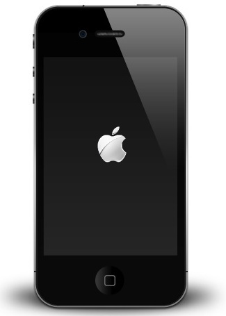

+++
date = '2025-07-19T01:16:24+08:00'
draft = false
title = '在互联网上说说话'
description = '作为一个从Windows 98时代就开始上网的"老网民"，我却用十几年时间完美诠释了什么叫"潜水"。两次社死让我学会了闭嘴，但现在我想重新开口说话。'
author = "小杨"
image = "my-pic.jpg"
+++

我自认接触互联网比较早。2001年，家里就有了装着Windows 98的电脑，几年后办理了拨号上网。那段悦耳的拨号声至今难忘。



只可惜，当时的我还是一名学龄前儿童，并不是什么“天才少年”，甚至大字不识几个，互联网之于我也就是一个玩Flash游戏的工具。所以理所当然就没有产生[《8岁少年家中沉迷编程写下这个网站第一行代码，现已成为千亿商业帝国》](/page/fake-news)这样的故事。

## 神奇的蓝色超链接

早年的互联网是一个“按需使用”的工具，“拨号上网”就决定了我不能24小时接入互联网，否则家里的电话就不能用了。（比起互联网，那时的家庭座机利用率似乎更高？）

从同学和朋友那儿口口相传得来的网址，小心翼翼地敲进浏览器的地址栏中，回车，一副充满文字的美好画面就逐渐渲染在显示器上。对准一个蓝色的超链接，点击，返回，就会变成紫色的超链接。

事情发生改变是小学时的某个暑假。一次，我向爸妈抱怨，无论如何就是无法掌握写作文的方法。几天后，我妈下班时带回家一张纸。对折过两次，展开后是半张横线纸，可能是从办公室的笔记本上撕的吧，纸上用蓝色圆珠笔写着：


我妈：“同事和我说，可以上这两个网站，把作文题目打进去，会有范文出来，你可以学习一下别人是怎么写的。”

晚饭过后，我拨号上网，打开浏览器，输入了这个网址，我以为会弹出个什么“XX作文网”，但我看到的是一个蓝色的Logo，和一个巨大的搜索框。

几次搜索后，我很快就意识到，这两个网站并不是什么作文范文网，而是一个“想找什么都能找得到”的神奇小网站。狠狠震撼了一把小小的我。

我把百度设为了IE主页。

## 两次社死现场

说起来，我在互联网上鲜少发布信息，至少过去是如此。现在回想起来，可能是源于两段不堪回首的往事。

大约是2007年吧，贴吧盛极一时，说是当时中文互联网最热闹的社区也不为过吧。

当年的贴吧是可以匿名发帖和回复的，年少无知的我，天真的以为这就是真正的“匿名”。

然后我就在贴吧中发出了我人生中第一个，也是最后一个帖子。

作为楼主，我肯定是实（用户）名发帖了，在收获一些回帖后，我便开始了匿名表演，发表了明显驳斥楼主观点的言论，放到现在的互联网语境下，就是当“串子”了。

果然，一石激起千层浪，帖子一时间火热起来，每次按下F5刷新都会有新的回帖。

我继续匿名表演：先是假装“理中客”，发表了一些支持楼主的言论；再是模仿围观群众，发表一些灌水回帖。

**知识点：** 贴吧的匿名发表，会在用户名位置显示脱敏后的发帖人IP地址。

只可惜当时的我并不掌握这个知识点，更不要提伪造IP的意识和手段了。

```
此  处       我晕！！14L 40L 还有62L是同一个人。
是  个       人格分裂的说？我怀疑就是LZ。
头  像    

某热心网友
                84楼  2007-04-** 20:40:21
```

经过以上网友的提醒，围观群众四散而去，当然也没忘了喷我两句。

更可怕的是，第二天有熟人通过我说话的方式，在线下质问了我，虽然我矢口否认，但我能感觉到对方并不买账。

于是LZ速速删帖保平安了。

时间来到了2010年，彼时的我，从苹果专卖店获得了人生第一台iPhone 4。

但不久后电源键坏了（这就是苹果的品控？），我不得不小心翼翼地使用着它，生怕关机后再也打不开。

但墨菲定律应验了，那一天还是来了。

于是我开始在各大“果粉”论坛开始搜索解决方案。然而相关的资料少之又少，难道就没有同是天涯沦落人的吗？

和如今不同，当年网购的潮流似乎还没有兴起，国内有苹果专卖店的省份也有限，因此全国各地的机友似乎更多持有着“非国行”的设备。

对于外版设备，在关机状态下，只要电量足够开机，那插入充电线时，就会点亮苹果Logo进入开机流程。



然而手持国行设备的我，亲测无用。

```山重水复疑无路，柳暗花明又一村```

我在绝望中反复插拔充电线时，突发奇想，在某次插入充电线之前，按住了```Home```键，沉寂已久的显示屏上突然亮起了苹果Logo，奇迹发生了。

一瞬间泪水涌起，下一瞬间我下定决心，为了拯救这个世界上和我一样陷入苦难的人类，我打开某果粉论坛，开始编辑新帖。

```喜大普奔！国行iPhone 4电源键坏了也能正常开机！```

前面也说过，坛友机友似乎持有的都是“非国行”的设备，他们似乎并不能与我共情。在他们看来，这不就是插上充电线就自动开机的事儿吗？犯得着这么矫情吗？

在一条条人身攻击的回复中，我年少的热情也被一次次浇熄。

这时出现了一个新的回复：

```别喷楼主了，国行就是这样的，直接插线不会开机的，人家都说了是国行的，你们一个个都在喷什么？```

但滑落谷底的人，仅凭一根细绳又怎么救得上来呢？

于是，同多年前一样，LZ速速删帖保平安了。

## 从此我选择旁观

从此以后，我成为了互联网的旁观者，用现代一点的话来说，我“退网”了。

令人庆幸的是，互联网很大。凭借我引以为傲的信息搜索和整合能力，我慢慢发现，在互联网上，你不需要提问，也能获得答案。

早年，我会加入各种讨论QQ群，然后开始潜水，看所有人的水群记录，偷偷地学习，但从不会主动发言。

后来，我会花时间在视频网站里看我感兴趣的视频，遇到风格对胃口的UP主，我也会关注，但也就点到为止了。我不发弹幕，不留评论，甚至不点赞投币，一度造成我的B站帐号有将近3000个硬币（我错了，我现在已经改了）。

现在，我也会在各个短视频平台，注册一个私密帐号，默默收藏对我有价值的视频，点开评论区看看讨论，然后刷下一个视频。

这似乎是在互联网上经历了几次不愉快的互动后留下的PTSD。只要不在互联网上制造信息，就不会被互联网伤害。

## 2025，重新出发

可能是到了年纪，开始想要记录些什么了，写博客成了脑海中第一个闪过的念头。

实际上，这些年，我也读过许多大佬的博客，也总能或多或少有些收获。但我曾经总是简单地认为，以自己的能力和水平并不足以在互联网上向他人输出什么有价值的内容。然而这可能是一个自我认知上的陷阱。

不是必须要成为一名专家，才有资格与他人分享你的见解的。真实，远比所谓的“专业”更重要。

所以，2025，重新出发，以一个不成熟的身份在互联网上留下一些“正在路上”的分享。将这里打造成我的赛博石碑和赛博壁画，永远留存在互联网上。

这次，我不会再删帖了。
